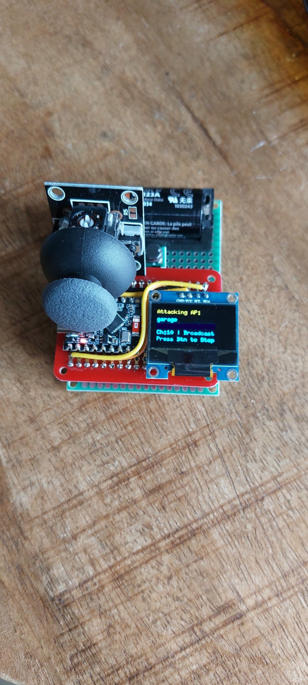
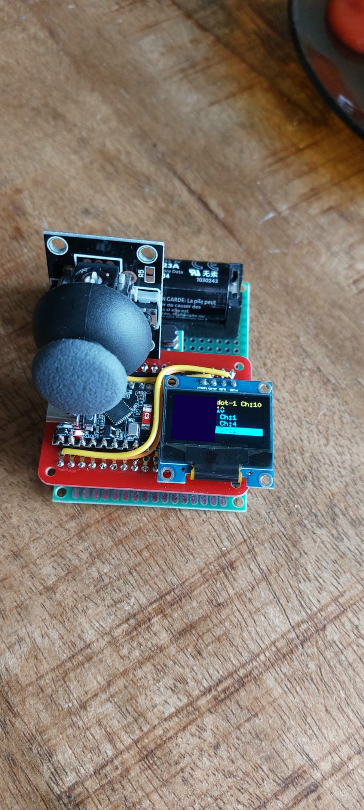
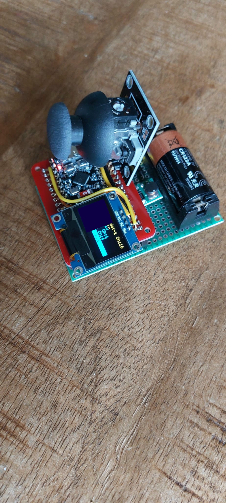
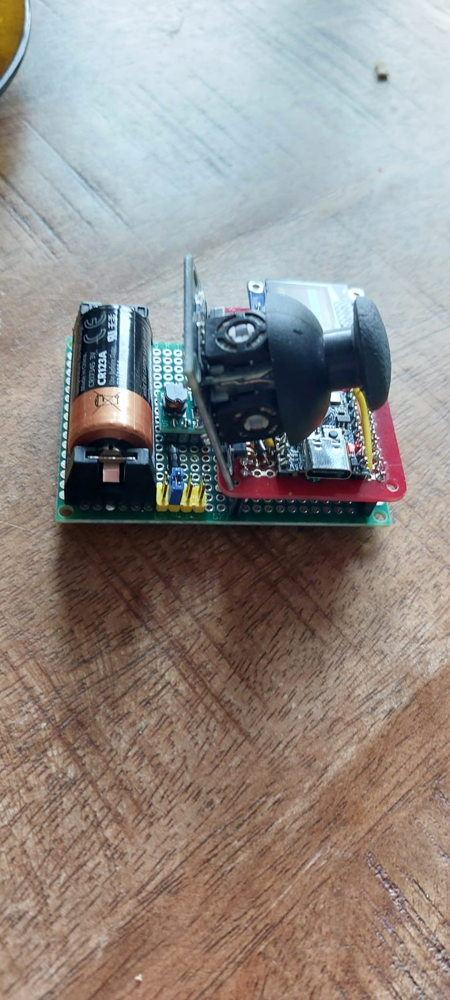

# esp32c3 broadcast deauth 2.4ghz

> This code is for educational purposes only. I am not responsible for any damage caused by this code.


Super cool device with joystick + esp32c3 + display + battery to prank my family and friends. You just select SSID and press button and it sends broadcast deauth packets which disconnect all devices from that SSID.






---

Espressif added a function `ieee80211_raw_frame_sanity_check` which forbids you to send deauth packets (packets with frame subtype `0xC0`). There are multiple ways to go around this, one is to actually monkeypatch `libnet80211.a`, to do that first you need to extract `ieee80211_output.o`, form it, so find out where the `.a` file is, for arduino ide on mac is at:

```
ROOT=~/Library/Arduino15/packages/esp32/tools/esp32-arduino-libs/idf-release_v5.3-cfea4f7c-v1/esp32c3/lib
AR=~/Library/Arduino15/packages/esp32//tools/esp-rv32/2405/bin/riscv32-esp-elf-ar
OBJDUMP=~/Library/Arduino15/packages/esp32/tools/esp-rv32/2405/bin/riscv32-esp-elf-objdump
```

copy `libnet80211.a` to `libnet80211.a.bak` and then you can do `mkdir /tmp/extracted && cd /tmp/extracted && $AR x ../libnet80211.a` so that you can open ieee80211_output.o with imnhex and find `ieee80211_raw_frame_sanity_check` (use `$OBJDUMP -D ieee80211_output.o` to find the proper offset) and fix the function to always return 0, then use `$AR rvs libnet80211.a ieee80211_output.o` to replace the old object file with the new one. Or you can try and patch the .a file directly.

Another easier way is to just overwrite the function in our code:

```
extern "C" int ieee80211_raw_frame_sanity_check(int32_t arg, int32_t arg2, int32_t arg3){
  return 0;
}
```

The compiler will complain that the function is already defined, so you need to change `platform.txt` in your arduino ide's esp32 folder on my mac its at `~/Library/Arduino15/packages/esp32/hardware/...platform.txt`

As explained at https://github.com/justcallmekoko/ESP32Marauder/wiki/arduino-ide-setup, you need to add `-w` and `-zmuldefs` to the compiler settings, `-w` to `build.extra_flags.esp32c3` and `-zmuldefs` to `compiler.c.elf.libs.esp32c3`


This is the function in question, with comments added from Claude:

```
00000000 <ieee80211_raw_frame_sanity_check>:
   0:   7179                add     sp,sp,-48        ; Allocate 48 bytes on stack
   2:   d606                sw      ra,44(sp)        ; Save return address
   4:   d422                sw      s0,40(sp)        ; Save callee-saved registers
   6:   d226                sw      s1,36(sp)
   8:   d04a                sw      s2,32(sp)
   a:   ce4e                sw      s3,28(sp)
   c:   cc52                sw      s4,24(sp)
   e:   ca56                sw      s5,20(sp)
  10:   c85a                sw      s6,16(sp)
  12:   e995                bnez    a1,46 <.L943>    ; If a1 (2nd arg) != 0, jump to .L943
  14:   000006b7            lui     a3,0x0           ; Load error message address
  18:   00068693            mv      a3,a3
  1c:   4605                li      a2,1             ; Error level
  1e:   04000593            li      a1,64            ; Line number
  22:   4505                li      a0,1             ; Module ID
  24:   00000097            auipc   ra,0x0           ; Call log function
  28:   000080e7            jalr    ra               ; "Buffer is null"

0000002c <.L973>:
  2c:   10200413            li      s0,258           ; Return code = 258 (error)

00000030 <.L942>:
  30:   8522                mv      a0,s0            ; Move return code to a0
  32:   50b2                lw      ra,44(sp)        ; Restore saved registers
  34:   5422                lw      s0,40(sp)
  36:   5492                lw      s1,36(sp)
  38:   5902                lw      s2,32(sp)
  3a:   49f2                lw      s3,28(sp)
  3c:   4a62                lw      s4,24(sp)
  3e:   4ad2                lw      s5,20(sp)
  40:   4b42                lw      s6,16(sp)
  42:   6145                addi    sp,sp,48         ; Deallocate stack
  44:   8082                ret                      ; Return

00000046 <.L943>:
  46:   47dd                li      a5,23            ; Min packet size = 23
  48:   8732                mv      a4,a2            ; a4 = a2 (packet length)
  4a:   00c7f663            bgeu    a5,a2,56 <.L945> ; If length < 23, error
  4e:   5dc00793            li      a5,1500          ; Max packet size = 1500
  52:   00c7df63            bge     a5,a2,70 <.L946> ; If length <= 1500, continue

00000056 <.L945>:                                    ; Packet size error path
  56:   000006b7            lui     a3,0x0           ; Load error message
  5a:   00068693            mv      a3,a3
  5e:   4605                li      a2,1             ; Error level
  60:   04000593            li      a1,64            ; Line number
  64:   4505                li      a0,1             ; Module ID
  66:   00000097            auipc   ra,0x0           ; Call log function
  6a:   000080e7            jalr    ra               ; "Invalid length"
  6e:   bf7d                j       2c <.L973>       ; Jump to error return

00000070 <.L946>:                                    ; Valid packet size path
  70:   000009b7            lui     s3,0x0           ; Load global structure
  74:   0009a783            lw      a5,0(s3)
  78:   00000937            lui     s2,0x0
  7c:   84aa                mv      s1,a0            ; s1 = a0 (1st arg, interface)
  7e:   4bfc                lw      a5,84(a5)        ; Load function pointer
  80:   00092503            lw      a0,0(s2)
  84:   842e                mv      s0,a1            ; s0 = a1 (buffer pointer)
  86:   8ab6                mv      s5,a3            ; s5 = a3 (4th arg)
  88:   9782                jalr    a5               ; Call function

  8a:   ec8d                bnez    s1,c4 <.L947>    ; If interface != 0, branch
  8c:   000007b7            lui     a5,0x0
  90:   0107aa03            lw      s4,16(a5)        ; Load global variable

00000094 <.L948>:
  94:   040a1063            bnez    s4,d4 <.L950>    ; If s4 != 0, check frame type

00000098 <.L949>:                                    ; Error path
  98:   000006b7            lui     a3,0x0           ; Load error message
  9c:   8726                mv      a4,s1
  9e:   00068693            mv      a3,a3
  a2:   4605                li      a2,1             ; Error level
  a4:   04000593            li      a1,64            ; Line number
  a8:   4505                li      a0,1             ; Module ID
  aa:   640d                lui     s0,0x3           ; Set error code
  ac:   00000097            auipc   ra,0x0           ; Call log function
  b0:   000080e7            jalr    ra
  b4:   0411                addi    s0,s0,4          ; s0 = 0x3004 (error code)

000000b6 <.L951>:
  b6:   0009a783            lw      a5,0(s3)         ; Load global structure
  ba:   00092503            lw      a0,0(s2)
  be:   4fbc                lw      a5,88(a5)        ; Load function pointer
  c0:   9782                jalr    a5               ; Call function
  c2:   b7bd                j       30 <.L942>       ; Return

000000c4 <.L947>:
  c4:   4785                li      a5,1             ; Check if interface == 1
  c6:   fcf499e3            bne     s1,a5,98 <.L949> ; If not, error
  ca:   000007b7            lui     a5,0x0
  ce:   0147aa03            lw      s4,20(a5)        ; Load different global var
  d2:   b7c9                j       94 <.L948>       ; Continue

000000d4 <.L950>:                                    ; Frame type checking
  d4:   00144603            lbu     a2,1(s0)         ; Load 2nd byte of frame
  d8:   00044683            lbu     a3,0(s0)         ; Load 1st byte of frame
  dc:   04067613            andi    a2,a2,64         ; Check if protected bit set
  e0:   00c6f713            andi    a4,a3,12         ; Extract frame type (bits 2-3)
  e4:   0f06f793            andi    a5,a3,240        ; Extract frame subtype (bits 4-7)
  e8:   ce11                beqz    a2,104 <.L952>   ; If not protected, check further

  ea:   000006b7            lui     a3,0x0           ; Load error message
  ee:   00068693            mv      a3,a3            ; "Protected frame not allowed"

000000f2 <.L971>:                                    ; Common error path
  f2:   4605                li      a2,1             ; Error level
  f4:   04000593            li      a1,64            ; Line number
  f8:   4505                li      a0,1             ; Module ID
  fa:   00000097            auipc   ra,0x0           ; Call log function
  fe:   000080e7            jalr    ra
 102:   a83d                j       140 <.L972>      ; Jump to error return

00000104 <.L952>:                                    ; Frame type checking
 104:   4621                li      a2,8             ; Check if type == 2 (Data frame)
 106:   04c70063            beq     a4,a2,146 <.L953> ; If data frame, branch
 10a:   ef19                bnez    a4,128 <.L954>   ; If type != 0, error
 10c:   08000613            li      a2,128           ; Check if subtype == 8 (Beacon)
 110:   04c78663            beq     a5,a2,15c <.L955> ; If beacon, allow
 114:   0e06f693            andi    a3,a3,224        ; Extract bits 5-7
 118:   04000613            li      a2,64            ; Check if subtype == 4 (Probe req)
 11c:   04c68063            beq     a3,a2,15c <.L955> ; If probe req, allow
 120:   0d000693            li      a3,208           ; Check if subtype == 13 (Action)
 124:   02d78c63            beq     a5,a3,15c <.L955> ; If action frame, allow

00000128 <.L954>:                                    ; Frame type error path
 128:   000006b7            lui     a3,0x0           ; Load error message
 12c:   00068693            mv      a3,a3            ; "Frame type/subtype not allowed"

00000130 <.L974>:                                    ; Common error path
 130:   4605                li      a2,1             ; Error level
 132:   04000593            li      a1,64            ; Line number
 136:   4505                li      a0,1             ; Module ID
 138:   00000097            auipc   ra,0x0           ; Call log function
 13c:   000080e7            jalr    ra

00000140 <.L972>:                                    ; Error return path
 140:   10200413            li      s0,258           ; Return code = 258 (error)
 144:   bf8d                j       b6 <.L951>       ; Jump to return

00000146 <.L953>:                                    ; Data frame check
 146:   01879713            slli    a4,a5,0x18       ; Shift subtype to check sign
 14a:   8761                srai    a4,a4,0x18       ; Arithmetic shift right
 14c:   00075863            bgez    a4,15c <.L955>   ; If subtype >= 0, allow
 150:   000006b7            lui     a3,0x0           ; Load error message
 154:   4721                li      a4,8             ; Data frame type
 156:   00068693            mv      a3,a3            ; "Invalid data frame subtype"
 15a:   bfd9                j       130 <.L974>      ; Jump to error

0000015c <.L955>:                                    ; Frame allowed path
 15c:   002c                addi    a1,sp,8          ; Set up stack buffer
 15e:   0ff4f513            andi    a0,s1,255        ; Zero-extend interface
 162:   00000097            auipc   ra,0x0           ; Call helper function
 166:   000080e7            jalr    ra
 16a:   4619                li      a2,6             ; Size = 6 (MAC address)
 16c:   00a40593            addi    a1,s0,10         ; Source addr in frame
 170:   0028                addi    a0,sp,8          ; Dest buffer
 172:   00000097            auipc   ra,0x0           ; Call memcpy
 176:   000080e7            jalr    ra
 17a:   8b2a                mv      s6,a0            ; Save result
 17c:   e48d                bnez    s1,1a6 <.L956>   ; If interface != 0, branch

 17e:   0e4a2503            lw      a0,228(s4)       ; Load MAC address
 182:   c911                beqz    a0,196 <.L957>   ; If null, skip
 184:   4619                li      a2,6             ; Size = 6 (MAC address)
 186:   00440593            addi    a1,s0,4          ; Dest addr in frame
 18a:   0511                addi    a0,a0,4          ; Source addr
 18c:   00000097            auipc   ra,0x0           ; Call memcmp
 190:   000080e7            jalr    ra
 194:   c105                beqz    a0,1b4 <.L958>   ; If match, continue

00000196 <.L957>:                                    ; Success path
 196:   0009a783            lw      a5,0(s3)         ; Load global structure
 19a:   00092503            lw      a0,0(s2)
 19e:   4401                li      s0,0             ; Return code = 0 (success)
 1a0:   4fbc                lw      a5,88(a5)        ; Load function pointer
 1a2:   9782                jalr    a5               ; Call function
 1a4:   b571                j       30 <.L942>       ; Return

000001a6 <.L956>:                                    ; Interface != 0 path
 1a6:   00440513            addi    a0,s0,4          ; Dest addr in frame
 1aa:   00000097            auipc   ra,0x0           ; Call helper function
 1ae:   000080e7            jalr    ra
 1b2:   d175                beqz    a0,196 <.L957>   ; If success, return success

000001b4 <.L958>:                                    ; Additional checks
 1b4:   fe0b11e3            bnez    s6,196 <.L957>   ; If s6 != 0, return success
 1b8:   000a9763            bnez    s5,1c6 <.L959>   ; If s5 != 0, continue checks
 1bc:   000006b7            lui     a3,0x0           ; Load error message
 1c0:   00068693            mv      a3,a3            ; "Invalid parameter"
 1c4:   b73d                j       f2 <.L971>       ; Jump to error

000001c6 <.L959>:                                    ; More frame checks
 1c6:   00144783            lbu     a5,1(s0)         ; Load 2nd byte of frame
 1ca:   03c7f713            andi    a4,a5,60         ; Check bits 2-5
 1ce:   c711                beqz    a4,1da <.L960>   ; If zero, continue
 1d0:   000006b7            lui     a3,0x0           ; Load error message
 1d4:   00068693            mv      a3,a3            ; "Invalid frame flags"
 1d8:   bf29                j       f2 <.L971>       ; Jump to error

000001da <.L960>:                                    ; Control frame check
 1da:   00044703            lbu     a4,0(s0)         ; Load 1st byte of frame
 1de:   46a1                li      a3,8             ; Type = 2 (Data frame)
 1e0:   8b31                andi    a4,a4,12         ; Extract frame type
 1e2:   fad71ae3            bne     a4,a3,196 <.L957> ; If not data frame, success
 1e6:   8b8d                andi    a5,a5,3          ; Extract ToDS/FromDS bits
 1e8:   e889                bnez    s1,1fa <.L961>   ; If interface != 0, branch

 1ea:   4705                li      a4,1             ; Check if ToDS/FromDS == 1
 1ec:   fae785e3            beq     a5,a4,196 <.L957> ; If yes, success
 1f0:   000006b7            lui     a3,0x0           ; Load error message
 1f4:   00068693            mv      a3,a3            ; "Invalid ToDS/FromDS for STA"
 1f8:   bded                j       f2 <.L971>       ; Jump to error

000001fa <.L961>:                                    ; AP interface check
 1fa:   4709                li      a4,2             ; Check if ToDS/FromDS == 2
 1fc:   f8e78de3            beq     a5,a4,196 <.L957> ; If yes, success
 200:   000006b7            lui     a3,0x0           ; Load error message
 204:   00068693            mv      a3,a3            ; "Invalid ToDS/FromDS for AP"
 208:   b5ed                j       f2 <.L971>       ; Jump to error
``` 

the crux is in:

```
00000104 <.L952>:                                    ; Frame type checking
 104:   4621                li      a2,8             ; Check if type == 2 (Data frame)
 106:   04c70063            beq     a4,a2,146 <.L953> ; If data frame, branch
 10a:   ef19                bnez    a4,128 <.L954>   ; If type != 0, error
 10c:   08000613            li      a2,128           ; Check if subtype == 8 (Beacon)
 110:   04c78663            beq     a5,a2,15c <.L955> ; If beacon, allow
 114:   0e06f693            andi    a3,a3,224        ; Extract bits 5-7
 118:   04000613            li      a2,64            ; Check if subtype == 4 (Probe req)
 11c:   04c68063            beq     a3,a2,15c <.L955> ; If probe req, allow
 120:   0d000693            li      a3,208           ; Check if subtype == 13 (Action)
 124:   02d78c63            beq     a5,a3,15c <.L955> ; If action frame, allow

00000128 <.L954>:                                    ; Frame type error path
 128:   000006b7            lui     a3,0x0           ; Load error message
 12c:   00068693            mv      a3,a3            ; "Frame type/subtype not allowed"
```

Think about how to overwrite the machine code so that the function always returns 0.